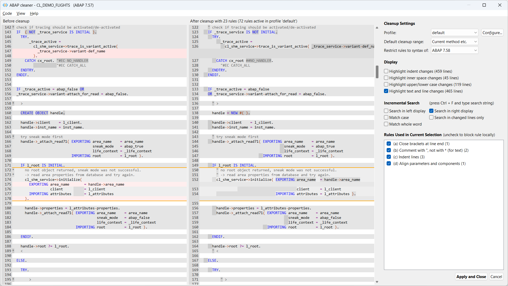

# Main Window

When cleaning ABAP code interactively with the ABAP cleaner UI,
you may navigate, search, and copy the cleaned code as follows:



## Keyboard Shortcuts

### Navigation

Key                     | Effect
----------------------- | --------------------------------------------------------------------------------------
_Up_, _Down_            | normal navigation
_PageUp_, _PageDown_    | normal navigation
_Ctrl + Home / End_     | move to start / end of code 
_Home_ / _End_          | navigate to first / last line on the current screen
_Shift + Up / Down_     | select lines
_Shift_ + click etc.    | select lines
_Left_ / _Right_        | navigate to previous/next finding (considering current highlight settings)
_Ctrl + Left_ / _Right_ | navigate to previous/next page with findings (considering current highlight settings)
_Ctrl + Up_ / _Down_    | scroll without changing selection
_type any number_       | navigate to a line number of the original code (shown on the left-hand side)
_a ... z_               | activate/deactivate item in list 'Rules Used in Current Selection'

### Incremental Search

Key                    | Effect
---------------------- | -------------------------------------------------------------------
_Ctrl + F_             | start search mode; afterwards, simply start typing the search text
_F3_ / _Enter_         | navgiate to next finding
_Shift + F3_ / _Enter_ | navgiate to previous finding
_Esc_                  | exit search mode

### Copy & Paste Code

Key                | Effect
------------------ | ------------------------------------------------------------------------
_Ctrl + V_         | paste code from clipboard and immediately process it with ABAP cleaner (stand-alone App only)
_Ctrl + A_         | select all code
_Ctrl + C_         | copy selected lines of cleaned code (right-hand side) to the clipboard
_Ctrl + Shift + C_ | copy selected lines of original code (left-hand side) to the clipboard

The Copy operations will always copy complete statements, 
even if only the first or last few lines of a multi-line statement are selected in the display. 


## Selecting a Profile

In order to process the current code with a different profile, simply select that profile from the 'Profile' list. 
Note that changes made in the 'Rules Used in Current Selection' list will be reset.

To configure an existing profile or create a new one, click on the 'Edit Profiles and Rules...' button 
to show the ['Profiles and Rules'](profiles.md) window.
When returning from this window with the 'Save Profiles and Exit' button, 
the code will automatically be reprocessed with the changed settings. 

## Restricting Rules to an ABAP Release

If you need to restrict code changes performed by the cleanup rules to the syntax of a specific ABAP Release 
(e.g. if your code must be downported to older releases), use the setting 
'Restrict rules to syntax of ABAP release' below the 'Profile' list. E.g., if you select release 7.53 or lower, 
cleanup rules that introduce calculation assignment operators such as += will be automatically skipped. 
Changes to this setting trigger a reprocessing of the current cleanup. 

When called from inside ADT, ABAP cleaner automatically determines the ABAP release of the current code document
and restricts rules to this release; with the setting on the UI, this can be restricted even further. 


## Display Settings

If you want to focus on certain types of changes, activate or deactivate the options 
'Highlight indent changes', 
'Highlight inner space changes' and 
'Highlight upper/lower case changes'. 
Both the highlighting in the display (with yellow / orange background color) 
and the navigation to the previous / next findings (with the _Left / Right_ keys) 
will then be restricted to the selected types of changes.

Further display options can be found in the 'View' menu: 'Zoom In', 'Zoom Default' and 'Zoom Out' for changing the 
font size; 'Highlight Declarations' to display declaration keywords such as ```DATA``` or ```FIELD-SYMBOLS``` in a 
different color; and 'Highlight Write Positions' to show variables in write positions in a different color.


## Incremental Search

In order to perform a text search, press _Ctrl + F_ and directly start typing the search string. 
Press _F3_ or _Enter_ to navigate to the previous / next finding. 
With the options in the 'Incremental Search' section, you can influence 
whether the left-hand and/or right-hand display is searched, 
and whether the search shall be limited to 'changed lines only' 
(which refers to the lines currently highlighted in yellow / orange, depending on the 'Display' settings). 


## Deactivating Rules for a Selection of Statements

If you navigate to (any line within) a statement that was changed by ABAP cleaner, or if you select multiple statements, 
the 'Rules Used in Current Selection' list will show 
which ABAP cleaner rules were used to clean the selected ABAP statement(s). 
Deactivate the checkbox(es) of one or several rule(s) in order to deactivate the rule for the current selection.
ABAP cleaner will then immediately reprocess the section accordingly. 
Deactivated rules will still appear as deactivated checkboxes to allow you to reactivate them. 

Note that this serves to deactivate rules in _specific_ code places, 
while the profiles should be used to _generally_ activate or deactivate rules. 
Deactivation of rules in specific code places will be lost when the code is processed again 
(e.g. with a different profile or by opening ABAP cleaner again).

**Continue reading**: [Profiles and rules](profiles.md)
